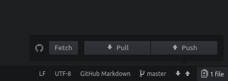

# Rule of Fear wiki

## Настройки

Для работы необходим `git` и `mkdocs`.

## Structure

Все страницы расположены в папке `docs`. В корне и в некоторых подкаталогах.

Все файлы формата `.md` из каталога `docs` попадают в итоговый сайт. Но в панель навигации попадают только файлы указанные в `mkdocs.yml`.

## Локальный вариант

Сайт можно запустить локально с помощью команды:

```
mkdocs serve
```

Она запускает локальную версию сайта по адресу [127.0.0.1:8000](http://127.0.0.1:8000/). Версия автоматически обновляется при изменении `.md` файлов.

## Изменения

После изменения нужно создать коммит. А потом пушнуть его в гитхаб.

```
git commit -a -m "Commit description"
git push
```

### В Atom

Правый нижний угол — управление гитом.



## Deploying

После сохранения изменений нужно вызвать команду:

```
mkdocs gh-deploy
```
Которая заложит в репозиторий новую версию сайта. Которая немедленно станет доступна.
